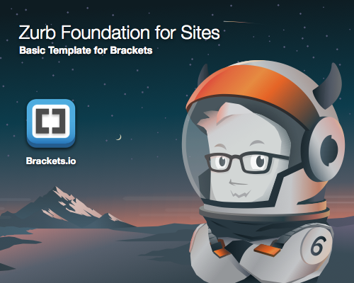

# Brackets Zurb Foundation 6#

A [Brackets](http://brackets.io/) extension to add Zurb Foundation 5 basic template to your page.

## Installation ##
1. Open the Brackets Extension Manager and search for "Zurb Foundation".
2. Download straight from GitHub using [https://github.com/gbratsos/brackets-zurb-foundation/archive/master.zip](https://github.com/gbratsos/brackets-zurb-foundation/archive/master.zip).
3. Extract the zip file. Copy the entire file to Backets's extension folder and reload Brackets.

## Updates ##
* 1.2.2, 07/05/2016 - Updated Basic Template for Foundation 6 for Sites (CDN version 6.2.1). Thanks to [@badcat](https://github.com/badcat)
* 1.2.0, 16/10/2015 - Updated menu link position and plugin architecture.
* 1.1.0, 14/9/2015 - Updated codebase and changed menu to File again.
* 1.0.4, 14/9/2015 - Updated jquery and changed menu to Edit.
* 1.0.2, 25/2/2015 - Merged pull request with path updates for CDNs. Thanks to [@wgoolsby](https://github.com/wgoolsby)
* 1.0.1, 9/11/2014 - Template fixes.
* 1.0.0, 7/11/2014 - Initial release, Added Zurb Foundation 5.4.7. All CSS and Javascript files are fetched from [CDN](http://cdnjs.com/libraries/foundation/).

## Directions ##
* File > New
* Then File > New Zurb Foundation 6 Document

This will create a Zurb Foundation 6 basic template, at cursor location.
In order to use full Zurb Foundation's features download from [http://foundation.zurb.com/](http://foundation.zurb.com/).

## License ##
This extension is based on the [Bootstrap Skeleton](https://github.com/mirorauhala/brackets-bootstrap-skeleton) by [Miro Rauhala](https://github.com/mirorauhala).

[MIT License](LICENSE)

## Recommended Brackets Addons ##

[Beautify](https://github.com/drewhamlett/brackets-beautify) extension to indent your code properly.

[Brackets Extension Rating](https://github.com/dnbard/brackets-extension-rating) to see downloads, stars and other information about Brackets extensions.

[Tabs custom-working](https://github.com/DH3ALEJANDRO/custom-work-for-brackets) adds toolbar including buttons show/hide with tabs of active documents on the top of the editor.

[Brackets ColorHints](https://github.com/konstantinkobs/brackets-colorHints) shows colors you used in your CSS file before as code hints.

[Brackets Lorem Ipsum](https://github.com/lkcampbell/brackets-lorem-ipsum) generates Lorem Ipsum text automatically in any Brackets document.

[Brackets Exclude Indexing File Tree](https://github.com/DimitrK/exclude-indexing-filetree) excludes folders from the Brackets project parser to avoid performance problems and search indexing files limitation.

[Interactive Linter](https://github.com/MiguelCastillo/Brackets-InteractiveLinter) for Brackets.

[Special HTML Characters](https://github.com/thaneuk/brackets-special-html-chars) for inline editing context menu will get an additional option to bring up a menu of common Special HTML characters to insert of the cursors position (e.g. Copyright, Trademark, Non-breaking space).

[TODO](https://github.com/mikaeljorhult/brackets-todo) displays all TODO comments in current document or project.

[Autoprefixer](https://github.com/mikaeljorhult/brackets-autoprefixer) parses CSS and add vendor prefixes automatically.

[Popup menu](https://github.com/Denisov21/Popup-menu-extension) adds additional functionality to Brackets editor like: `cut`, `copy`, `paste`,  `comment line`, `comment block` and `save all`.

[SASSHints](https://github.com/konstantinkobs/brackets-SASShints) Autocompletion for SASS/SCSS variables.

[wakatime](https://wakatime.com) tracks your hours spending on your projects.

[Emmet](http://emmet.io/) - emmet addon for Brackets.

## Themes ##

[Tomorrow Night](https://github.com/Brackets-Themes/TomorrowNight) theme for Brackets.

[OS X Style Flat & Dark](https://github.com/aydieneue/brackets-osx-flat-dark-theme) theme for Brackets.

[Brackets Devicons](https://github.com/bvermeule/brackets-devicons) for Brackets.
